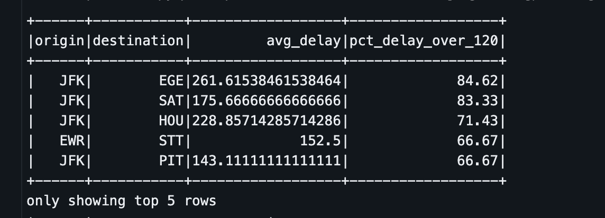
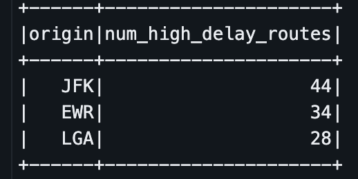
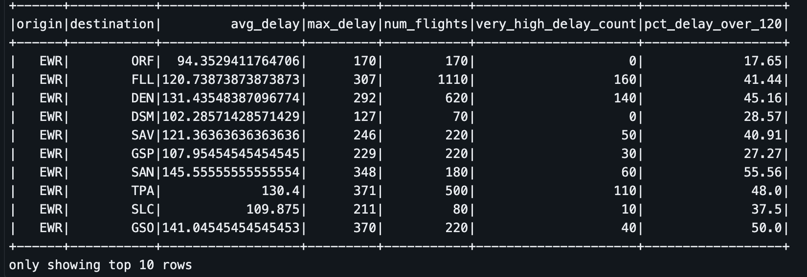
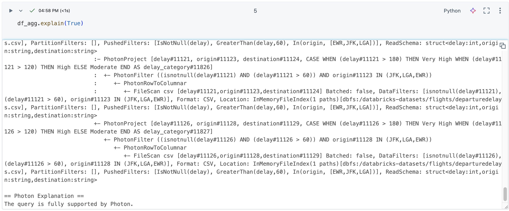
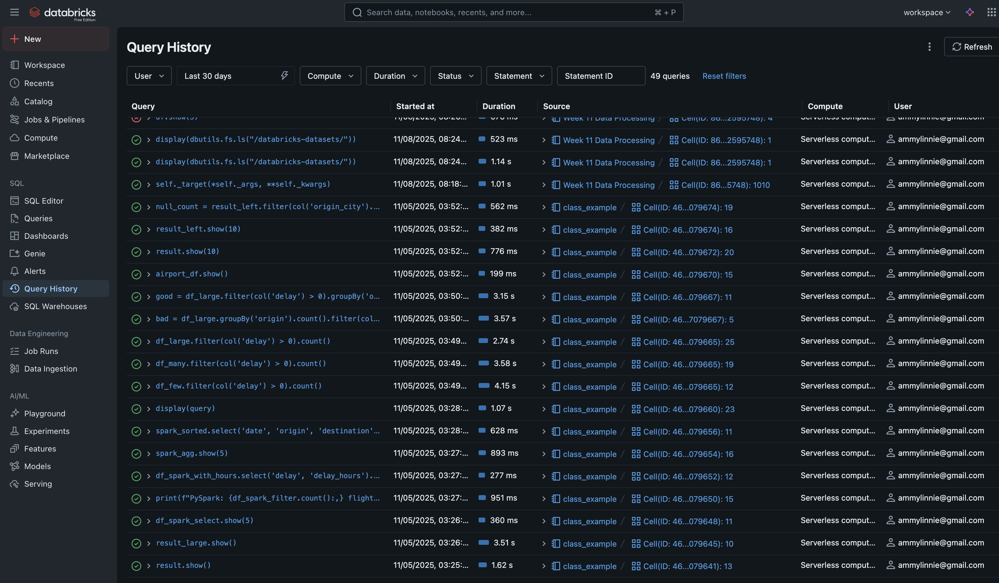
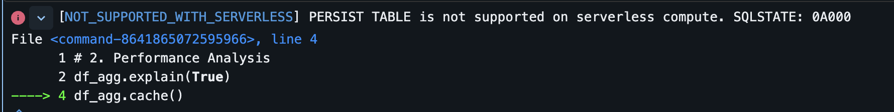
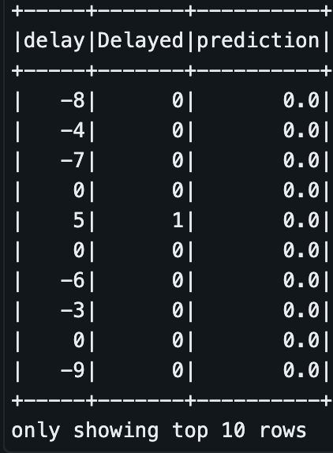
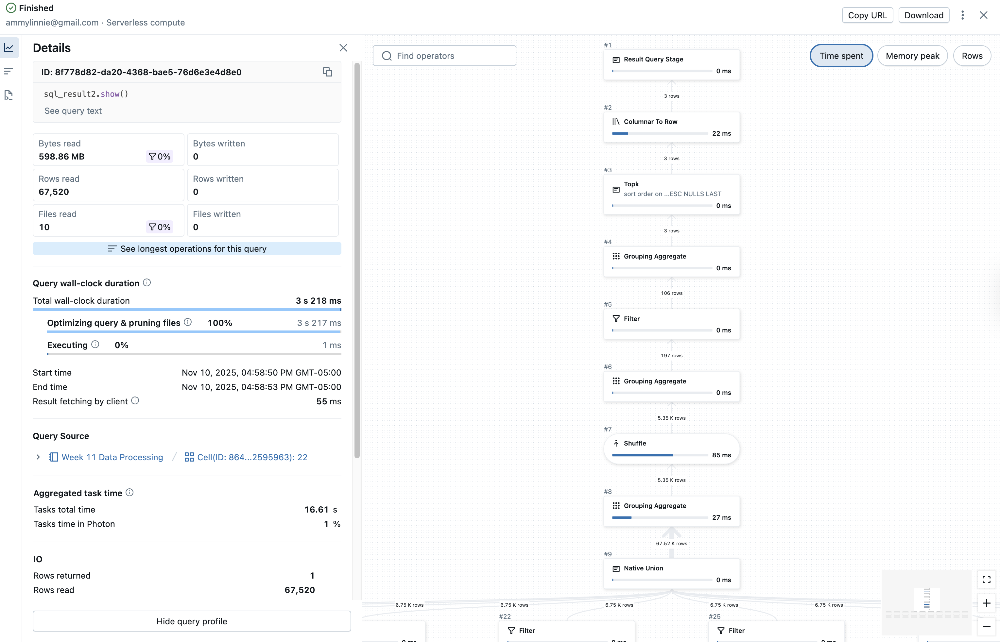

# PySpark Data Processing (Week 11)
This repository includes a PySpark data processing pipeline that demonstrates distributed data processing, lazy evaluation, and optimization strategies.

## Dataset Description

The dataset used in this project is the *Flights Departure Delays* dataset, which contains information about various flights departing from airports in the U.S. The dataset includes the following columns:

- **date**: Date of the flight.
- **delay**: Delay in minutes.
- **distance**: Distance of the flight in miles.
- **origin**: Originating airport code.
- **destination**: Destination airport code.

The dataset is sourced from the [Databricks flights dataset](https://databricks.com/).

The data was replicated to simulate a larger dataset to demonstrate the scalability of the pipeline.

## Pipeline Description

The pipeline performs the following steps:

1. **Data Loading**: The dataset is read in CSV format and replicated multiple times to simulate a larger dataset.
2. **Transformations**:
    - Filters flights with delays greater than 60 minutes.
    - Filters flights originating from New York airports (JFK, LGA, EWR).
    - Adds a `delay_category` column to classify the delay into three categories: Very High, High, and Moderate.
    - Groups by origin and destination, with several aggregations (average delay, max delay, number of flights).
3. **SQL Queries**:
    - Query 1: Filters flights with more than 30% of delays over 120 minutes and sorts them by the percentage.

    

    - Query 2: Aggregates by origin and counts the number of routes with an average delay greater than 120 minutes.

    

4. **Write Results**: The processed data is written back to a database table.



5. **Performance Optimization**: Filters were applied early in the pipeline, and unnecessary shuffles were avoided.

## Performance Analysis

### Query Optimization and Physical Plan

The pipeline uses `.explain(True)` to display the physical plan of the query execution. The output from `.explain()` reveals several key optimizations that Spark applied to the query execution. 

One notable optimization is **filter pushdown**. In the physical plan, we can see that Spark pushed the filters `delay > 60` and `origin IN [JFK, LGA, EWR]` down to the scan stage, which means these filters were applied as early as possible during the data reading process. This helps reduce the amount of data being loaded into memory, thus improving performance. The physical plan also indicates that the `IsNotNull(delay)` and `GreaterThan(delay, 60)` filters were applied directly at the data scan stage, which ensures that only rows meeting these conditions are read from the source, further minimizing the amount of data processed downstream.

In addition, **partition pruning** was not explicitly used in this pipeline, as the dataset is in CSV format, but if partitioned data were involved, Spark could optimize further by skipping irrelevant partitions.

The plan also shows that the query is fully supported by **Photon**, which is a high-performance execution engine in Databricks designed to accelerate queries. The Photon engine processes the query in a columnar fashion, further improving the speed of the query execution by reducing the amount of data that needs to be scanned and processed.

Here are the results of `.explain()`, which shows the physical execution plan:



To optimize the pipeline, several strategies were employed to enhance performance and reduce resource usage. First, **early application of filters** like `delay > 60` and `origin IN ["JFK", "LGA", "EWR"]` ensured that irrelevant data was excluded as soon as possible, reducing the size of the dataset and thus speeding up subsequent transformations. By filtering early, only the necessary records were passed to the later stages, minimizing memory consumption and improving overall execution time. Additionally, **column pruning** was applied by selecting only the required columns early in the pipeline. This avoided loading unnecessary data into memory, further optimizing the pipeline's efficiency and resource utilization.

To reduce the overhead caused by data shuffling, **local aggregations** were used wherever possible. For instance, the `groupBy` operation was applied after the data was already filtered, which minimized the amount of data shuffled between nodes. This helped Spark perform the aggregation more efficiently by reducing the data volume being processed. Likewise, **partitioning** is a powerful optimization technique that can improve query performance by ensuring data is evenly distributed across the cluster. By distributing data into appropriate partitions, Spark can process each partition locally, which reduces the need for shuffling during operations like `groupBy`, `join`, or complex aggregations. When the data is partitioned effectively, related data stays co-located on the same node, minimizing the amount of data that needs to be transferred across the network. This results in faster execution times and more efficient use of resources, especially for large datasets where network communication can become a bottleneck. Partitioning can significantly enhance performance by limiting the data shuffle overhead, improving query execution times, and reducing memory usage.

### Query Details


### Performance Bottlenecks

While the pipeline performs efficiently, there are a few performance bottlenecks that were identified, especially when dealing with large datasets:
1. **Large dataset size**: The dataset was replicated to simulate a large dataset, and while this helps test scalability, it also led to **increased memory usage** and slower query times, particularly for larger partitions. The more data Spark has to process, the more resources it requires, and this can slow down operations, especially when performing aggregations.
   
2. **Shuffling during groupBy and aggregation**: The `groupBy` operation, which involves aggregations like average delay and count of flights, is an operation that often causes **data shuffling**. Shuffling can be very expensive in terms of both time and memory, particularly when dealing with large datasets. It forces Spark to redistribute data across partitions to perform aggregations or joins, which can lead to delays in query execution.

3. **Intermediate transformations**: Without caching, Spark needs to recompute intermediate transformations every time the same dataset is used. This leads to **repeated computations**, particularly when running multiple actions such as `.count()` and `.show()`. This is not only inefficient but also increases the overall execution time, especially when transformations are complex.


### Caching Optimization
*Caching is unavailable in Databricks Serverless* 



In Spark, the `.cache()` function allows you to keep data in memory, preventing Spark from recalculating it every time you access it. Normally, Spark operates lazily, waiting to process data until you execute an action like `.show()` or `.count()`, which means it repeats all steps—such as reading, filtering, and grouping—every time you use the same dataset. However, when you call `.cache()`, Spark saves a copy of that DataFrame in memory after its first computation, allowing it to quickly access the data from memory on subsequent uses instead of redoing all the work. This can significantly speed up your program, especially when running multiple actions or queries on the same data.

## Actions vs. Transformations
In Spark, operations are divided into two main types: **transformations** and **actions**. 

**Transformations (Lazy)**

Transformations are lazy, meaning they don’t execute immediately. Spark tracks the steps (like filters, selects, or joins) it needs to perform later but waits until an action is called to execute the plan. 

Example from the code: 
```
transformation = df_large.select("date", "delay", "distance", "origin", "destination")
```
This line selects columns but doesn’t process any data yet; Spark simply records this step in the plan.

**Actions (Eager)**

Actions prompt Spark to run the computation and produce a result. Common actions include:
- `.count()`: counts the number of rows
- `.show()`: displays a sample of data
- `.write()`: saves the DataFrame

Example from the code: 
```
record_count = transformation.count()
sample_data = transformation.show()
```
Here, Spark executes the entire plan—reading data, applying transformations, and returning results. 

### Execution Time Comparison

The following table summarizes the execution times for different operations in Spark:

| Operation Type   | Operation   | Description                                  | Time (seconds) |
|------------------|-------------|----------------------------------------------|-----------------|
| Transformation    | `select()`  | Chose columns, but didn’t run yet           | 0.0003          |
| Action            | `count()`   | Counted all records (triggered computation) | —               |
| Action            | `show()`    | Displayed top 20 rows (triggered computation)| 0.6280          |

The transformation was nearly instantaneous because Spark didn’t execute it yet, while the actions took longer as they caused Spark to read and process the data.

## Machine Learning Model 

## Machine Learning with PySpark

This code utilizes PySpark to build a machine learning model aimed at predicting flight delays. It begins by importing the necessary libraries, such as `when`, `Pipeline`, `VectorAssembler`, `StringIndexer`, `OneHotEncoder`, and `RandomForestClassifier`.

Next, a new column named **`Delayed`** is created, indicating delays with **1** if the `delay` is greater than **0** and **0** otherwise. The categorical features **`origin`** and **`destination`** are indexed using **`StringIndexer`**, transforming them into numerical formats suitable for model training. Following this, one-hot encoding is applied to the indexed features to represent them as binary vectors.

The features for the model, specifically **`distance`** and the one-hot encoded **`origin_vec`**, are combined into a single feature vector using **`VectorAssembler`**. A **`RandomForestClassifier`** is then configured with parameters like the number of trees and maximum depth, utilizing the feature vector for prediction and the **`Delayed`** column as the label.

A **`Pipeline`** is constructed to sequence various stages, including indexing, encoding, vector assembly, and classification. The data is split into training and test sets with an **80/20 split**, and the pipeline is fit on the training data to train the model. Predictions are made on the test data, showcasing actual delays, labels, and model predictions.

The results can be viewed, showing columns for **`delay`**, **`Delayed`**, and **`prediction`**. 

### Example Output


### Limitations

The performance of the model is significantly influenced by the quality and quantity of the input data. If the dataset **`df_large`** contains missing values, inaccuracies, or is not sufficiently large, the model may not learn patterns effectively, leading to suboptimal predictions. 

Moreover, the choice of using only **5 trees** in the **RandomForestClassifier** may limit the model's ability to capture complex relationships in the data. While this parameter is set for demonstration purposes, a small number of trees could lead to underfitting, making it less generalizable to unseen data. Proper validation techniques, such as cross-validation, should be implemented to assess and potentially optimize the model further.

Finally, the selection of features included in the model—namely, **`distance`** and the one-hot encoded **`origin_vec`**—can significantly affect its accuracy. If relevant features are omitted (e.g., additional factors like **`destination`**, **weather conditions**, or **time of day**), or if irrelevant features are included, the model may produce inaccurate predictions. To enhance model performance, a thorough feature selection process, along with exploratory data analysis, should be conducted to identify the most impactful features for predicting flight delays.

## Successful Pipeline Execution 


## Key Findings from Analysis
The pipeline successfully processed flight delay data, which includes information such as flight delays, origin, and destination. Key optimizations were implemented to improve performance, including early filter application, which reduced the dataset size by filtering out flights with delays under 60 minutes and focusing on flights originating from New York airports (JFK, LGA, EWR). By filtering early, unnecessary data was excluded, which helped reduce memory usage and sped up the processing.

The SQL queries provided valuable insights into the data. The first query focused on flights with delays over 120 minutes, filtering and sorting the results by the percentage of such delays. This revealed routes with the highest delays, such as JFK → EGE, with an average delay of 261.62 minutes, and 84.62% of flights delayed over 120 minutes. This query helped identify which routes experience the most significant delays, a crucial finding for airport or airline optimization.

The second query aggregated data by origin airport and counted the number of routes with an average delay greater than 120 minutes. Results showed that JFK had the highest number of high-delay routes (44), followed by EWR (34) and LGA (28). This aggregation helped identify which airports had the highest number of delayed routes, further helping target areas for improvement.

Performance bottlenecks were also identified. The large size of the dataset (simulated by replication) led to increased memory usage and slower query times, especially for larger partitions. Shuffling during groupBy and aggregation operations added to the query time, and repeated computations without caching resulted in inefficiencies when running multiple actions.

In summary, the pipeline effectively processed the data and applied optimizations such as early filtering, column pruning, and local aggregations. SQL queries provided actionable insights into high-delay routes and airports. However, there is still room for improvement in handling large datasets and leveraging caching to speed up repeated operations.